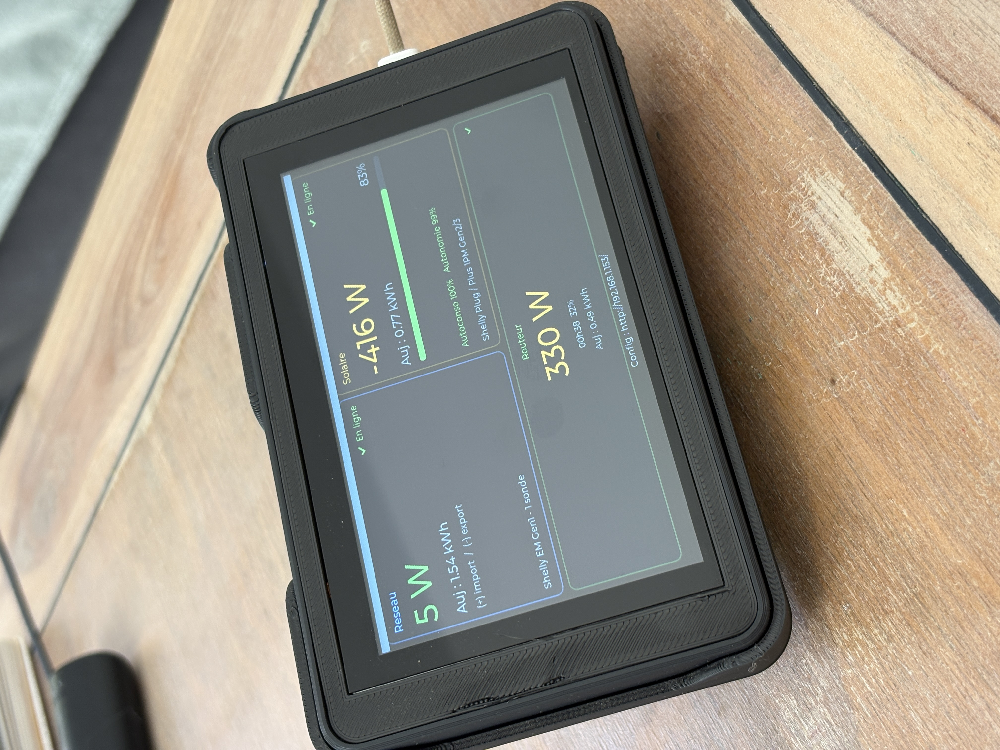
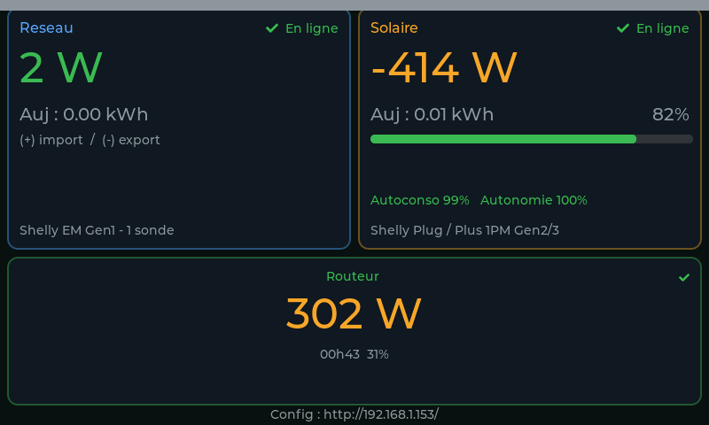
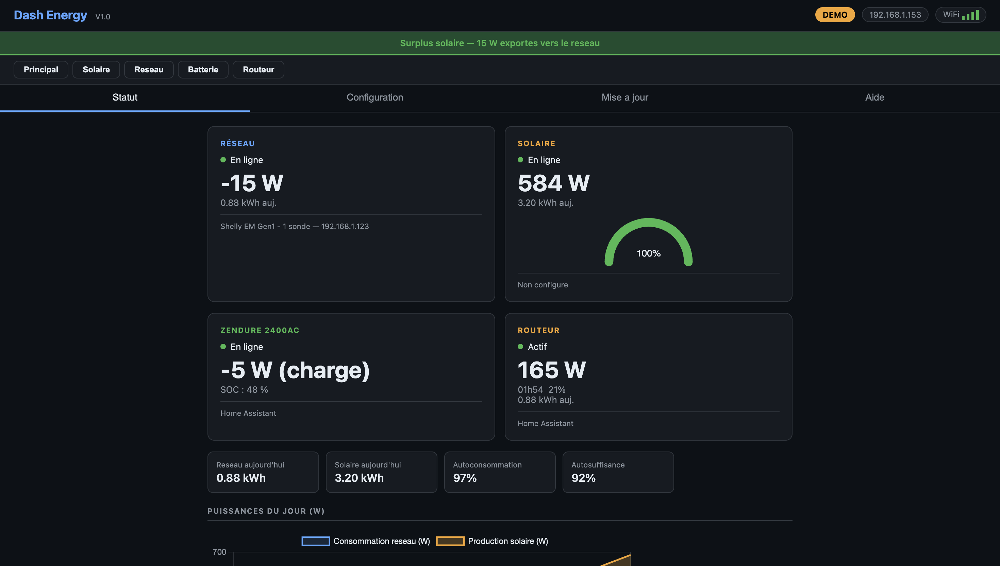
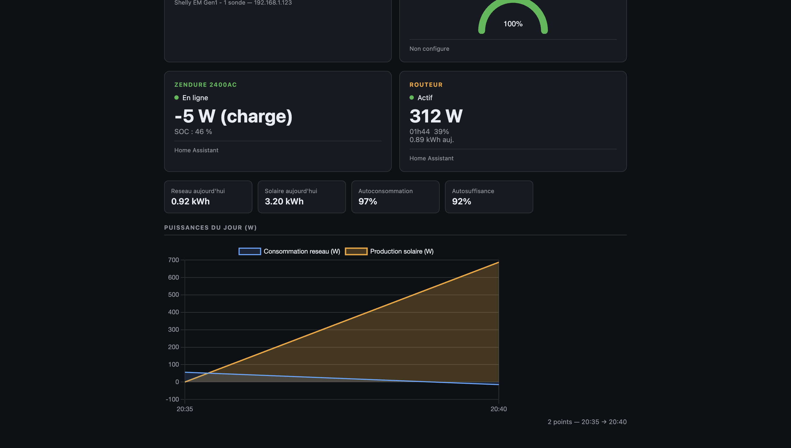
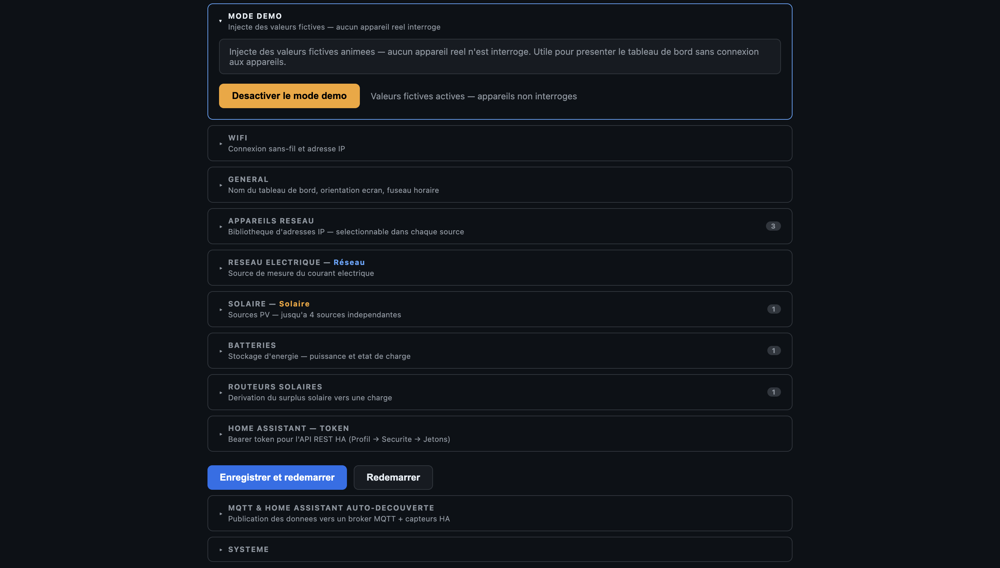
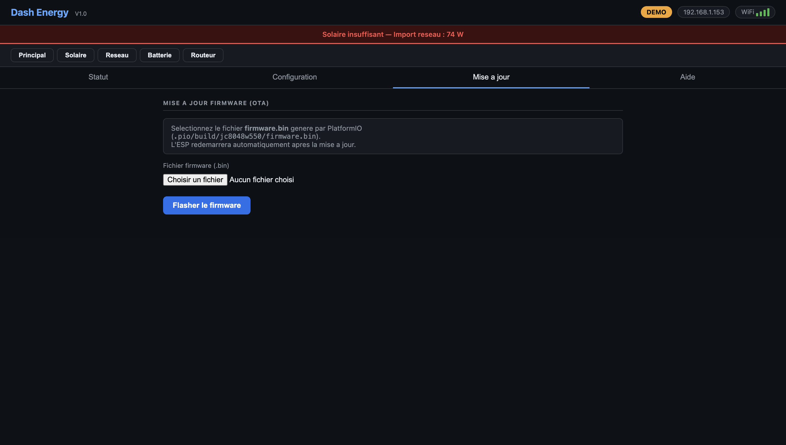
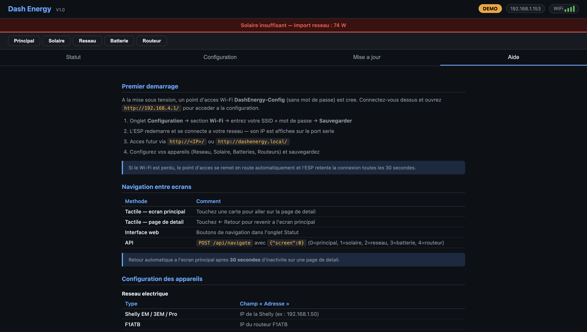

# Dash Energy — ESP32-S3 Home Energy Monitor

**Real-time energy dashboard on a 800×480 touchscreen, built on ESP32-S3.**  
*Tableau de bord énergie temps réel sur écran tactile 800×480, basé sur l'ESP32-S3.*

[](https://platformio.org/)
[](https://lvgl.io/)
[](CHANGELOG.md)
[](LICENSE)



---

## Pourquoi ce projet ?

En juillet 2025, j'ai installé **3 kWc de panneaux solaires** chez mes parents :
6 panneaux Jolywood 500 Wc, 3 micro-onduleurs Hoymiles HMS-1000-2T (un par phase
sur une installation triphasée), et 2 routeurs solaires F1ATB sur les deux
chauffe-eau. Les panneaux sont disposés au sol par paires, orientés Est (120°),
Sud (180°) et Ouest (240°) pour répartir la production sur toute la journée.

Pour le monitoring : **OpenDTU** pour la production, **Shelly 3EM** pour la
consommation réseau, **F1ATB** pour l'état des routeurs.

Le problème : pour savoir si on peut lancer une machine à laver au bon moment,
il fallait consulter trois interfaces différentes — OpenDTU pour la prod, Shelly
pour le surplus, F1ATB pour voir si les chauffe-eau absorbent le reste.
J'ai mis en place **Home Assistant** pour centraliser tout ça, mais mes parents
continuaient de ne regarder que l'écran OpenDTU pour la production, sans voir
le tableau d'ensemble.

**La solution évidente : un écran physique permanent**, visible d'un coup d'œil
depuis la pièce, sans téléphone, sans application. Un seul regard pour savoir
si l'on produit, si l'on consomme, et si c'est le bon moment pour lancer
un appareil électroménager.

C'est ce qu'est Dash Energy.

---

## Features / Fonctionnalités

| Feature | Détail |
|---|---|
| **Display** | 800×480 RGB touchscreen (JC8048W550), GT911 capacitive touch |
| **5 LVGL screens** | Main · Solar detail · Grid detail · Battery detail · Router detail |
| **Auto-return** | Returns to main screen after 30 s of inactivity |
| **Multi-source solar** | Up to 4 independent solar sources, aggregated total |
| **Energy history** | Today · Week · Month — persisted on SD card across reboots |
| **Real-time charts** | 6-min high-freq ring + full-day 5-min curve on web UI |
| **Web interface** | Status, configuration, OTA update, built-in user guide |
| **Web navigation** | Control screen from browser — useful while device is wall-mounted |
| **MQTT** | Publish all values + Home Assistant Discovery |
| **Demo mode** | Animated simulated data — no devices required |
| **WiFi fallback** | Captive-portal AP + auto-reconnect every 30 s |
| **Static IP** | Optional static IP / gateway / DNS configuration |

---

## Screenshots / Captures d'écran

### Écran principal (ESP32-S3)


*Réseau 2 W (export −414 W solaire), Autoconso 99 %, Routeur 302 W — capture directe depuis le firmware*

### Interface Web — Statut


*Statut temps réel : Réseau −15 W (export), Solaire 584 W, Batterie Zendure charge −5 W (SOC 48 %), Routeur 165 W*


*Énergies du jour + courbe de puissance haute résolution*

### Interface Web — Configuration et outils


*Tous les paramètres : démo, Wi-Fi, réseau, solaire, batteries, routeurs, HA, MQTT*


*Mise à jour du firmware sans câble*


*Guide de premier démarrage et navigation*

---

## Supported Devices / Appareils supportés

> **Testé personnellement** avec : Home Assistant · Shelly EM · Shelly 3EM · Shelly Plug S · OpenDTU · F1ATB.  
> Les autres appareils listés sont implémentés mais **non testés** — retours bienvenus via les [issues](../../issues).

### Grid / Réseau

| Device | Statut | Notes |
| --- | --- | --- |
| Shelly EM (1 ou 2 phases) | ✅ Testé | |
| Shelly 3EM (1, 2 ou 3 phases) | ✅ Testé | |
| Shelly Pro EM / Pro 3EM | ⚠️ Non testé | |
| F1ATB (routeur solaire) | ⚠️ Non testé | Puissance réseau + routage intégré |
| Home Assistant | ✅ Testé | Entité puissance + optionnel énergie, tension, intensité |

### Solar / Solaire (jusqu'à 4 sources)

| Device | Statut | Notes |
| --- | --- | --- |
| OpenDTU | ✅ Testé | Micro-onduleurs Hoymiles — limite % par onduleur |
| AhoyDTU | ⚠️ Non testé | Micro-onduleurs Hoymiles |
| Fronius Symo / Primo | ⚠️ Non testé | API Solar.web locale |
| Shelly Plug S (Gen1 / Gen2+3) | ✅ Testé | |
| Shelly EM / 3EM | ✅ Testé | 1, 2 ou 3 phases |
| Home Assistant | ✅ Testé | Entité puissance + optionnel énergie journalière |

### Battery / Batterie (jusqu'à 4)

| Device | Statut | Notes |
| --- | --- | --- |
| JK-BMS via ESPHome | ⚠️ Non testé | [syssi/esphome-jk-bms](https://github.com/syssi/esphome-jk-bms) + `web_server` |
| Home Assistant | ✅ Testé | Entités puissance, SOC, tension, intensité |

### Router / Routeur solaire (jusqu'à 4)

| Device | Statut | Notes |
| --- | --- | --- |
| F1ATB | ✅ Testé | Routeur solaire français — triac %, durée, forçage (via HA) |
| Home Assistant | ✅ Testé | Entités puissance, énergie, durée, triac %, actif |

---

## Hardware / Matériel

**Tested board: Guition JC8048W550** (available on AliExpress)

| Composant | Détail |
|---|---|
| SoC | ESP32-S3-WROOM-1, 240 MHz, 512 KB SRAM, 8 MB OPI PSRAM |
| Flash | 16 MB QSPI |
| Écran | 5 pouces IPS 800×480 RGB parallel, rétroéclairage GPIO 2 |
| Tactile | GT911 capacitif I2C (SDA=19, SCL=20, RST=38) |
| SD card | SPI (CS=10, MOSI=11, MISO=13, CLK=12) |

> **⚠️ GPIO 0** est le bouton BOOT/reset — ne pas l'utiliser dans le firmware.  
> **GPIO 2** (rétroéclairage) est safe — ne déclenche pas de redémarrage.

### Support d'écran / Enclosure

Le support de bureau pour le JC8048W550 peut être imprimé en 3D :  
🖨️ **[XTouch Pro Base — Guition 5" LCD (MakerWorld)](https://makerworld.com/fr/models/1016156-xtouch-pro-official-base-for-guition-5inch-lcd#profileId-996406)**

---

## Getting Started / Démarrage rapide

### 1. Prérequis

- [PlatformIO](https://platformio.org/) (VS Code extension ou CLI)
- Câble USB-C vers l'ESP32-S3
- (Optionnel) Carte microSD FAT32 pour la persistance hebdo/mensuelle

### 2. Cloner le dépôt

```bash
git clone https://github.com/Alex77138/Energy-Dashboard.git
cd Energy-Dashboard
```

### 3. Créer `src/config.h`

```bash
cp src/config.h.example src/config.h
```

Éditez `src/config.h` pour renseigner votre SSID/mot de passe Wi-Fi.  
Ces valeurs ne servent qu'au tout premier démarrage — ensuite le Wi-Fi se configure via l'interface web.

### 4. Compiler et flasher (premier flash — câble USB requis)

> Le premier flash nécessite un câble **USB-C** branché à l'ESP32-S3 et
> PlatformIO (extension VS Code ou CLI). Les mises à jour suivantes peuvent
> se faire sans câble via l'onglet **Mise à jour (OTA)** de l'interface web.

```bash
pio run --target upload
```

### 5. Premier démarrage

1. L'écran s'allume et affiche l'interface principale (mode démo actif par défaut si aucun appareil n'est configuré).
2. Un point d'accès Wi-Fi **DashEnergy-Config** est créé (sans mot de passe).
3. Connectez-vous à ce réseau et ouvrez `http://192.168.4.1/` dans un navigateur.
4. Allez dans l'onglet **Configuration** et renseignez votre réseau Wi-Fi, puis vos appareils.
5. Cliquez **Sauvegarder** — le tableau de bord redémarre et se connecte à votre réseau.

> L'adresse IP locale est affichée dans le moniteur série au démarrage.  
> Vous pouvez aussi utiliser `http://dashenergy.local/` (mDNS).

---

## Web Interface / Interface web

Accessible depuis n'importe quel navigateur sur le réseau local.

| Onglet | Contenu |
|---|---|
| **Statut** | Puissances temps réel, énergie Auj/Sem/Mois, navigation écran |
| **Graphique** | Courbe 2 h (haute fréquence) + courbe 24 h (00:00 → maintenant) |
| **Configuration** | Réseau, solaire (multi-sources), batteries, routeurs, MQTT, Wi-Fi, OTA |
| **Mise à jour** | Flash OTA d'un fichier `.bin` |
| **Aide** | Mode d'emploi complet intégré |

### Endpoints API

| Endpoint | Méthode | Description |
|---|---|---|
| `/api/status` | GET | Toutes les mesures en temps réel (JSON) |
| `/api/config` | GET / POST | Lire ou écrire la configuration |
| `/api/daily` | GET | Courbe journalière réseau+solaire (JSON) |
| `/api/realtime` | GET | Ring haute fréquence 90 pts (JSON) |
| `/api/navigate` | POST | Changer l'écran actif `{"screen": 0..4}` |
| `/api/demo` | POST | Activer/désactiver le mode démo `{"demo": true}` |
| `/api/restart` | POST | Redémarrer l'ESP |
| `/api/wifi` | POST | Configurer le Wi-Fi |
| `/update` | POST | OTA firmware upload |

---

## SD Card / Carte SD

La carte SD est **optionnelle** mais recommandée pour conserver l'historique hebdomadaire et mensuel entre les redémarrages.

Format : **FAT32**, taille de partition recommandée ≤ 32 GB.

Fichiers créés automatiquement :

| Fichier | Contenu |
|---|---|
| `/daily2.bin` | Baselines journalières réseau + solaires + routeurs |
| `/period.bin` | Bases hebdomadaires et mensuelles |
| `/dayring.bin` | Courbe journalière (ring 288 pts × 5 min) |
| `/energy_log.csv` | Historique CSV horodaté (si SD présente) |

---

## Configuration Détaillée

### Fuseau horaire

Syntaxe POSIX TZ — exemples :

| Zone | Valeur |
|---|---|
| France / Belgique / Suisse | `CET-1CEST,M3.5.0,M10.5.0/3` |
| UTC | `UTC0` |
| UK | `GMT0BST,M3.5.0/1,M10.5.0` |

### Rotation écran

| Valeur | Résultat |
|---|---|
| `0` | Connecteur USB à gauche (position normale) |
| `2` | Connecteur USB à droite (rotation 180°) |

### Home Assistant

1. Dans HA : *Profil* → *Sécurité* → *Jetons d'accès longue durée* → **Créer un jeton**
2. Copiez le jeton dans le champ **Token HA** de la configuration
3. Renseignez l'**adresse IP:port** de votre serveur HA (ex : `192.168.1.10:8123`)
4. Les entités s'écrivent sous la forme `sensor.nom_de_l_entite`

---

## Building from Source / Compilation

```bash
# Install dependencies
pio pkg install

# Build only
pio run

# Build + upload
pio run --target upload

# Serial monitor
pio device monitor --baud 115200
```

**Mémoire :** Flash ~25–30 % sur 6.55 MB partition OTA · RAM ~40 % sur 328 KB · PSRAM utilisée pour les framebuffers LVGL et ring buffers web.

---

## Architecture

```text
main.cpp          — Setup, tâches FreeRTOS (display/poll/web/loop)
display.cpp       — Arduino_GFX, LVGL init, driver tactile GT911
ui.cpp            — 5 écrans LVGL, navigation, mise à jour
webserver.cpp     — Interface web, API REST, graphiques, OTA
device_config.cpp — Persistance NVS (configuration)
sd_logger.cpp     — Persistance SD (journalier, hebdo, mensuel, ring)
mqtt_pub.cpp      — Publication MQTT + HA Discovery
shelly.cpp        — Drivers Shelly EM/3EM/Pro/Plug
opendtu.cpp       — Driver OpenDTU (Hoymiles)
ha_fetch.cpp      — Client Home Assistant REST API
battery.cpp       — Driver ESPHome JK-BMS
fronius.cpp       — Driver Fronius Solar API
f1atb.cpp         — Driver F1ATB (routeur solaire)
```

**Tâches FreeRTOS :**

| Tâche | Core | Priorité | Rôle |
|---|---|---|---|
| `display_task` | 0 | 2 | LVGL tick + UI update (500 ms) |
| `poll_task` | 0 | 1 | Polling appareils (4 s) + accumulation |
| `web_task` | 1 | 1 | Serveur HTTP + WebSocket |
| `loop()` | 1 | — | Wi-Fi watchdog + DNS captif |

---

## Known Limitations / Limitations connues

- Pas d'authentification sur l'interface web (usage réseau local uniquement)
- OTA non signé — à utiliser uniquement sur réseau de confiance
- Sans carte SD : énergie hebdomadaire/mensuelle perdue au redémarrage
- Maximum 4 sources solaires, 4 batteries, 4 routeurs

---

## Credits

- [LVGL](https://lvgl.io/) — GUI library
- [Arduino_GFX](https://github.com/moononournation/Arduino_GFX) — Display driver
- [TouchLib](https://github.com/mmMicky/TouchLib) — GT911 touch driver
- [ArduinoJson](https://arduinojson.org/) — JSON parsing
- [PubSubClient](https://github.com/knolleary/pubsubclient) — MQTT
- [syssi/esphome-jk-bms](https://github.com/syssi/esphome-jk-bms) — JK-BMS ESPHome component

---

## License / Licence

Copyright (C) 2026 Alexandre Richard

Ce projet est distribué sous licence **GNU General Public License v3.0 or later**.  
Vous êtes libre de l'utiliser, le modifier et le redistribuer, à condition de publier
vos modifications sous la même licence.

See [LICENSE](LICENSE) for the full text — [https://www.gnu.org/licenses/gpl-3.0.html](https://www.gnu.org/licenses/gpl-3.0.html)
